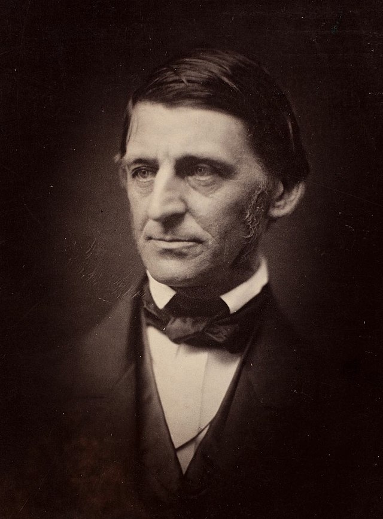

# Ralph Waldo Emerson

> "Whoso would be a man must be a nonconformist. He who would gather immortal palms must not be hindered by the name of goodness, but must explore if it be goodness."

One day in early sprnig I decided to go on a hike. The hike began at my doorstep and I planned to walk across the valley due east until III got into the mountaints. From there I wuold explore and sese what I coudl find. With my walkiing stick, camelback, hat and other hikinig attire, I looked rather strange for someone walking down the street. I got more than a few strange glances from people confused. "Why is he dressed liike that?" theye wondered. Somepeople might have even wondereed if I was homeless. But I noticed how, once I reacheed the trailhead, I no longer seemed uot of place. I was among my people, my setting. They all were a little less crazy than I and decided to drive to the trailhead.

By seriously seeking truth you will start to stick out. You will say no to things others say yest to. You'll say yes to other things people say no to.

To be someone who seeks truth is to be a non-confoormistt. You'll stick out like a hiker in the city until you reach your place.